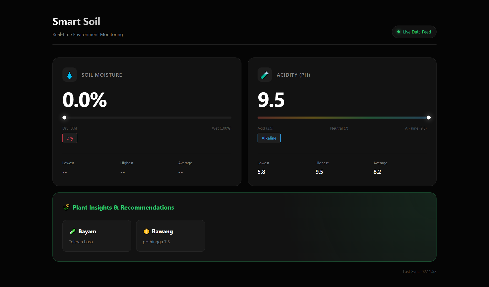

# 🌱 Smart Soil Monitoring System (IoT)

A precision agriculture solution designed to monitor soil pH and moisture levels in real-time. This project utilizes an **ESP32** microcontroller integrated with **ThingSpeak API** and features a professional **Modern Dark-Mode Dashboard** for data visualization.

## 📸 Dashboard Preview

## ✨ Key Features

* **Real-time Monitoring:** Tracks Soil Moisture (%) and Soil Acidity (pH).
* **WiFi Manager:** Easy network configuration without hardcoding credentials (AP Mode).
* **Cloud Integration:** Seamless data logging to ThingSpeak IoT Platform.
* **Intelligent Analysis:** Provides automatic crop recommendations based on soil conditions.
* **Modern UI:** Responsive, dark-themed dashboard built with clean CSS and Bento-grid layout.

## 🛠️ Hardware Stack

* **Microcontroller:** ESP32 DOIT DEVKIT V1
* **Soil Moisture Sensor:** Capacitive Soil Moisture Sensor v1.2
* **pH Sensor:** Analog pH Sensor Kit
* **Connectivity:** WiFi (2.4 GHz)

## 💻 Software & Libraries

* **IDE:** Arduino IDE
* **Libraries:** * `WiFiManager` (by tzapu)
    * `ThingSpeak` (by MathWorks)
* **Web Technologies:** HTML5, CSS3 (Modern Flexbox/Grid), Vanilla JavaScript (Fetch API).

## 🚀 Installation & Setup

### 1. Firmware Upload
1.  Open the `firmware/` folder.
2.  Install the required libraries in Arduino IDE.
3.  Configure your `Channel ID` and `Write API Key` in the code.
4.  Upload to ESP32.

### 2. Web Dashboard Usage
1.  Open `dashboard/index.html` in any code editor.
2.  Replace `CHANNEL_ID` and `READ_API_KEY` with your ThingSpeak credentials.
3.  Open the file in a browser to start monitoring.

## 🤝 Contributing

Feel free to fork this repository and submit pull requests to improve the recommendation algorithms or UI design.

## 📄 License

This project is open-source and available under the [MIT License](LICENSE).
